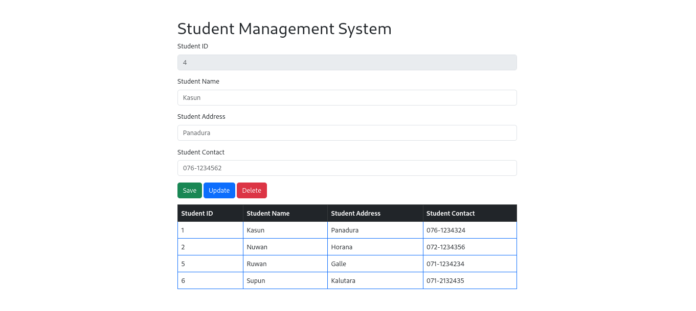

# Student Management System Spring Frontend
#### version 1.0.0
I created this application for understanding the usage and workflow
of HTML and JavaScript. AJAX is used in here to connect the Frontend with the API.

## Technologies

- HTML
- JS
- Boostrap
- jQuery

## Setup

- Install MYSQL
- Run Backend API
- Run the application

## UI of the Application
